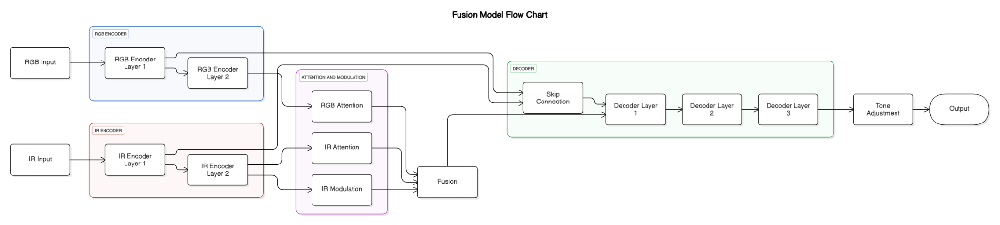

# Adaptive RGB-IR Fusion for Low-Light Pedestrian Detection

A dual-stream fusion model that combines RGB and infrared images into a single 3-channel "fused" image, designed to boost pedestrian detection performance in nighttime scenes. The fused output is directly compatible with pretrained RGB object detectors, no architecture changes needed.

On the KAIST nighttime benchmark, fine-tuning Deformable DETR on fused inputs improves mAP@0.5 from **0.55 (RGB-only) to 0.91**, a 65% relative improvement.

📄 [Read the full paper](docs/paper.pdf)

## How it works



The model takes paired RGB and IR images and learns to produce a single RGB-like image that keeps the semantic detail of RGB while pulling in the thermal contrast of IR, especially in dark regions. It uses:

- Two separate encoders (one for RGB, one for IR)
- Attention-guided fusion with an IR modulation block that dynamically reweights thermal features based on local brightness
- A decoder with skip connections and a tone adjustment step
- A multi-part loss combining brightness-aware reconstruction, gradient preservation (Sobel), IR feature alignment, VGG16 perceptual loss, SSIM, and artifact suppression

The fused images are then used to fine-tune Deformable DETR in two phases (gradually unfreezing more layers), and compared against an RGB-only baseline.

## Results

| Modality | mAP@0.5 |
|----------|---------|
| RGB only | 0.5500 |
| Fused (ours) | **0.9088** |

| Fusion quality metric | Score |
|---|---|
| Average SSIM | 0.3843 |
| Average PSNR | 8.58 dB |
| IR Gradient Preservation | 0.9556 |
| Mutual Information (IR ↔ Fused) | 1.4941 |

## Repo structure

```
.
├── notebooks/
│   ├── 01_rgb_baseline_finetune.ipynb     # RGB-only Deformable DETR baseline
│   ├── 02_fusion_model_training.ipynb     # Train the RGB-IR fusion model
│   └── 03_fusion_model_finetune.ipynb     # Fine-tune Deformable DETR on fused images
├── sample_data/                           # Small sample of KAIST RGB/IR images + annotations
├── docs/
│   └── paper.pdf                          # Full write-up with methodology and results
└── README.md
```

## Running the notebooks

These notebooks were developed in Google Colab and are easiest to run there.

1. Open a notebook (e.g. `02_fusion_model_training.ipynb`) in [Google Colab](https://colab.research.google.com/)
2. Upload the sample data from `sample_data/` (or mount your own KAIST dataset)
3. Pretrained models and the full dataset are available here: [Drive link](https://drive.google.com/drive/folders/11nOgYSqk2eIU98jUsBUi7ysdos1A376?usp=sharing)
4. Update the data/model paths in the first few cells to point to your uploaded files
5. Run all cells

**Suggested order:**
1. `01_rgb_baseline_finetune.ipynb` — establishes the RGB-only baseline
2. `02_fusion_model_training.ipynb` — trains the fusion model that generates fused images
3. `03_fusion_model_finetune.ipynb` — fine-tunes Deformable DETR on the fused outputs and evaluates

## Dataset

[KAIST Multispectral Pedestrian Dataset](https://soonminhwang.github.io/rgbt-ped-detection/), paired RGB and thermal IR images, day and night. This project focuses on nighttime scenes.

## Notes

- Models were trained on Google Colab; pretrained weights are linked above rather than included in this repo due to size.
- A short demo video showing fusion and detection results is also available in the Drive folder above.
